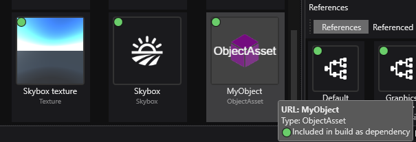
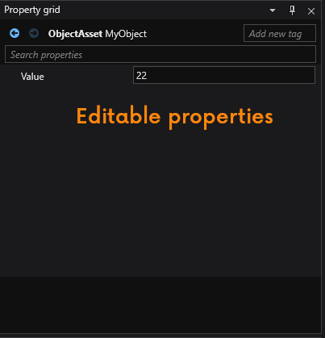
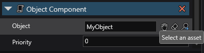
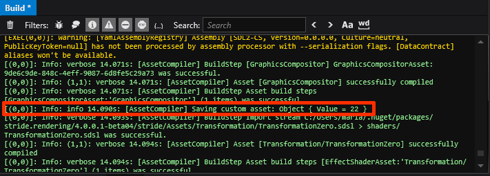
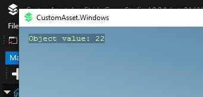

# Stride Custom Asset

This is an example on how to create custom assets for Stride. See `Object.cs` for the definition. The asset is editable in the GameStudio, but first you need to create the asset file by hand.

### Available in AssetView

### Editable in property grid

### You can reference it in a component

### It's compiled by the AssetCompiler App

### Available in game
